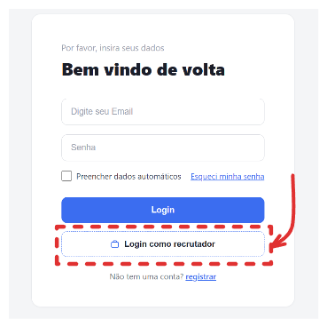
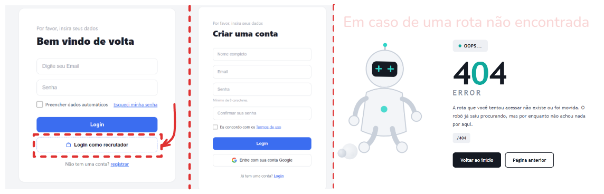
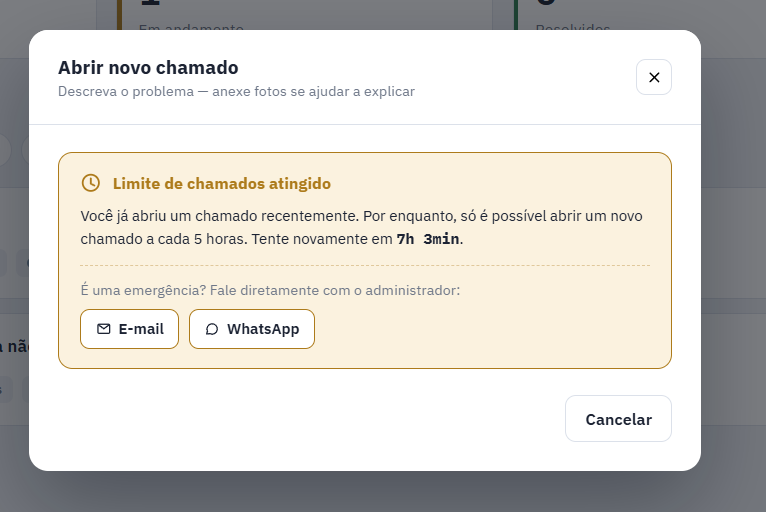

[🇧🇷 Português](./readme.pt.md) | [🇺🇸 English](./readme.md)

# Enterprise Ticketing System

> Enterprise platform with an integrated ticketing (WO) system, allowing user registration/login, file uploads, ticket creation and tracking, and a complete administrative panel.
> Web system developed in Node.js/Express, with session-based authentication, file uploads (with ticket attachments stored in Supabase Storage), and a technical ticketing module with attachments, comments, priorities, and service statuses.

## Demo

Want to test the system in operation?
****Access the production version:****
******[https://sistema-de-chamados-3z1c.onrender.com/]

> ****Note:**** On the first visit, Render may take a few seconds to start the server because it uses hibernation on free plans.

## 🚧 Project in Development

> ****This project is constantly evolving.****
> New features, improvements, fixes, and refactorings are frequently added. During this process, some screens, resources, and images present in the `docs` folder may undergo changes and differ from the actual project, so I ask for your understanding.
> I am continuously working to keep all documentation and screenshots up to date, but there may be a small gap between changes in the code and the documentation update. As an independent project, small discrepancies may occur.
> Thank you for your understanding! =)

---

# Table of Contents

* [About the Project](#-about-the-project)
* [ Demo](#-demo-1)
* [ Project Architecture](#-project-architecture)
* [ Application Flow](#application-flow)
  * [ User Registration](#user-registration)
  * [ Login](#login)
  * [ Logout](#logout)
  * [ View Tickets](#view-tickets)
  * [ Search Ticket](#search-ticket)
  * [ Create Ticket](#create-ticket)
  * [ Send Attachments](#send-attachments)
  * [ Administrative Routes Flow](#administrative-routes)
* [ Uploading Attachments with Supabase Storage](#-uploading-attachments-with-supabase-storage)
* [ Technologies Used](#-technologies-used)
* [ Folder Structure](#-folder-structure)
* [ Installation](#-installation)
* [ Environment Configuration](#-environment-configuration)
* [ Database](#-database)
* [ Running the Project](#-running-the-project)
* [ API Documentation](#-api-documentation)
  * [Authentication](#authentication)
  * [User](#user-protected-routes)
  * [Admin](#admin-protected-routes--admin-permission)
  * [Tickets](#tickets)
  * [Public Upload](#public-upload)
* [ Security](#-security)
* [ Tests](#-tests)
* [ Future Improvements](#-future-improvements)
* [ How to Contribute](#-how-to-contribute)
* [ License](#-license)
* [ Author](#-author)

# About the Project

The ticketing system was born with a robust user authentication system focused on security and evolved to include a ticket/WO system. The application allows users to register, log in, send files, and open tickets; while administrators change the priority and status of each service.

## Features

* ✔ User registration and authentication (session + bcrypt)
* ✔ Login system with session regeneration (anti-session-fixation)
* ✔ Permission control (regular user vs. admin)
* ✔ Administrative area (video upload, ticket management)
* ✔ Ticket (WO) creation and management with priority and status
* ✔ Direct ticket attachment uploads to ****Supabase Storage**** (private bucket, without going through the server disk)
* ✔ Attachment viewing via temporary ****signed URL****, generated on demand for any authenticated user
* ✔ Upload and storage of other files (avatars, videos, ZIP/PDF)
* ✔ Data validation (name, email, password, MX domain)
* ✔ Anti-XSS sanitization on all text inputs
* ✔ Integration with PostgreSQL database

---

# Demo

Example:

## Recruiter Login



## Login/Register/Non-existent Route Screen



## User Screen


## User Screen



## Admin Screen


---

# Project Architecture

```
User
   |
   ↓
Frontend (login, registration, upload, dashboard, admin)
   |
   ↓
API Backend (Express)
   |
   ├── Middlewares (auth, admin, sanitize, validators, upload/multer)
   |
   ├── Database (PostgreSQL)
   |      ├── users
   |      ├── videos
   |      ├── tickets
   |      ├── ticket_attachments      (stores only the path inside the bucket)
   |      └── ticket_comments
   |
   └── File Storage
          ├── Local disk (multer) — avatars and videos
          └── Supabase Storage — ticket attachments (private bucket) and ZIP/RAR/PDF
                 └── access always via signed URL, generated at read time
```

---

---

# Application Flow

Execution flow of the system's main requests, from the arrival of the request to the response to the client.

## Table of Contents

* [Base Pipeline](#base-pipeline)
* [User Registration](#user-registration)
* [Login](#login)
* [Logout](#logout)
* [View Tickets](#view-tickets)
* [Search Ticket](#search-ticket)
* [Create Ticket](#create-ticket)
* [Send Attachments](#send-attachments)
* [Administrative Routes](#administrative-routes)

---

## Base Pipeline

Every request passes through this common core before reaching the specific controller. The flows below only show what changes in relation to it.

```text
Client → Express (app.js) → Sanitize Middleware → Auth Middleware → Controller → Model → PostgreSQL → HTTP Response
```

---

## User Registration

`POST /auth/register`

```text
Client → Sanitize → Auth Middleware (public route, authtrue) → Validation (express-validator)
   → Auth Controller (createUser) → User Model → PostgreSQL → HTTP Response
```

---

## Login

`POST /auth/login`

```text
Client → Sanitize → Auth Controller → User Model → PostgreSQL
   → Password comparison (bcrypt) → Session Regeneration → Session Cookie → HTTP Response
```

---

## Logout

`POST /auth/logout`

```text
Client → Sanitize → Session Destruction → HTTP Response
```

---

## View Tickets

`GET /api/chamados`

```text
Client → Sanitize → Auth Middleware
   → Tickets Controller (counts attachments via LEFT JOIN) → PostgreSQL → HTTP Response
```

---

## Search Ticket

`GET /api/chamados/\:id`

```text
Client → Sanitize → Auth Middleware → Tickets Controller
   → PostgreSQL (ticket + attachment paths)
   → Supabase Storage (signed URL per attachment, valid for 1h)
   → HTTP Response (attachments already with "url" ready)
```

---

## Create Ticket

`POST /api/chamados` (multipart/form-data)

```text
Client → Sanitize → Auth Middleware → Multer (memoryStorage, without saving to disk)
   → Tickets Controller:
        BEGIN transaction
        → INSERT ticket
        → per attachment: upload to Supabase Storage + createSignedUrl
        → INSERT ticket_attachments (stores only the path)
        → COMMIT (or ROLLBACK + file removal, in case of error)
   → HTTP Response (attachments with signed "url")
```

---

## Send Attachments

`POST /api/chamados/\:id/anexos` (multipart/form-data)

```text
Client → Sanitize → Auth Middleware → Multer (memoryStorage)
   → Tickets Controller (reuses subirAnexo from ticket creation)
   → Supabase Storage + PostgreSQL → HTTP Response
```

---

## Administrative Routes

```text
Client → Sanitize → Auth Middleware → Administrator Verification → Controller → PostgreSQL → HTTP Response
```

> ****Note:**** all protected routes require a valid session. Administrative routes perform an additional admin privilege check.

# Uploading Attachments with Supabase Storage

Ticket attachments ****do not**** remain on the server disk — they go directly to a private bucket in Supabase Storage. Operation summary:

1. `multer` is configured with `memoryStorage()`, so the file sent by the form arrives at the controller as `arquivo.buffer`, without ever touching the disk.
2. `utils/supabaseAnexos.js` centralizes the Storage logic:

   * `subirAnexo(chamadoId, arquivo)` — uploads the buffer to the `chamados-anexos` bucket, with a unique name (`\<chamadoId>/\<uuid>.\<extensão>`), and already returns a signed URL valid for 1 hour.
   * `removerAnexos(nomesArquivos)` — removes files from the bucket; used during rollback when the Postgres transaction fails.
   * `gerarUrlAssinada(nomeArquivo)` — generates a new signed URL on demand, used whenever a ticket is viewed (the creation URL may already have expired).
3. The database (`chamado\_anexos.caminho\_arquivo`) stores ****only the internal bucket path****, never a URL — this way, expiration of the signed URL does not corrupt anything; it is always generated again when reading.
4. Since the bucket is private, the backend uses the Supabase ****service_role key**** (never the public/`anon` key), which provides full access to Storage without depending on RLS policies.
5. Any authenticated user accessing `GET /api/chamados/\:id` receives the attachments already with a `url` ready for direct use in `\` or `\<a href>`.

---

---

# Technologies Used

## Backend

* Node.js
* Express.js
* PostgreSQL (`pg`)
* Express Session
* Authentication middleware (`isAuthenticated`, `admin`, `authtrue`)
* File uploads (`multer`, with `memoryStorage` for ticket attachments)
* Validation (`express-validator`)
* Anti-XSS sanitization (`xss`)
* Bcrypt for password hashing
* Supabase Storage (SDK `@supabase/supabase-js`) — ticket attachments and ZIP/RAR/PDF, with signed URLs

## Frontend

* HTML5
* CSS3
* JavaScript (vanilla)

## Tools

* Git
* GitHub
* VS Code
* Postman

## Hosting

* Render / VPS / Cloud

---

# Folder Structure

```
InsideBox
│
├── backend
│   │
│   ├── controllers
│   │   └── chamadosController.js
│   │
│   ├── models
│   │   └── userModel.js
│   │
│   ├── routes
│   │   ├── authRoutes.js
│   │   ├── chamados.js
│   │   ├── protectedRoutes.js
│   │   └── publicupload.js
│   │
│   ├── middleware
│   │   ├── authMiddleware.js
│   │   ├── authtrue.js
│   │   ├── sanitize.js
│   │   ├── validators.js
│   │   └── upload.js              (multer with memoryStorage, limit of 5 files/10MB)
│   │
│   ├── utils
│   │   └── supabaseAnexos.js      (subirAnexo, removerAnexos, gerarUrlAssinada)
│   │
│   ├── config
│   │   ├── dbpg.js
│   │   └── supabase.js
│   │
│   ├── database
│   │   └── schema.sql
│   │
│   ├── uploads                    (avatars and videos — ticket attachments no longer use this folder)
│   └── server.js
│
├── frontend
│   │
│   ├── pages
│   │   ├── login.html
│   │   ├── register.html
│   │   ├── upload.html
│   │   ├── dashboard.html          (ticket list + detail modal with attachments)
│   │   ├── admin.html
│   │   └── 404.html
│   │
│   ├── css
│   └── javascript
│
├── .env
├── package.json
└── README.md
```

---

# Installation

## Prerequisites

Before starting, make sure you have installed:

* Node.js 18+
* Git
* PostgreSQL 13+ configured (Preferably in Cloud)
* A Supabase account/project, with a private bucket named `chamados-anexos` created in Storage

---

## Clone the project

```bash
git clone https\://github.com/usuario/Sistema-de-Chamados-Empresarial.git
```

Access the folder:

```bash
cd Sistema-de-Chamados-Empresarial
```

---

## Install dependencies

```bash
npm install
```

Main dependencies used in the project:

```bash
npm install express express-session pg bcrypt multer express-validator xss dotenv @supabase/supabase-js disposable-email-domains-js
```

---

# Environment Configuration

Create a `.env` file in the project root:

```env
PORT=3000
DATABASE\_URL=postgres\://usuario\:senha\@localhost:5432/sistema-de-chamados
SESSION\_SECRET=sua\_chave\_secreta
SUPABASE\_URL=[https://seu-projeto.supabase.co](https://seu-projeto.supabase.co)
SUPABASE\_SERVICE\_ROLE\_KEY=sua\_secret\_key\_do\_supabase
```

> ⚠️ `SUPABASE\_SERVICE\_ROLE\_KEY` is the ****secret**** key (formerly `service\_role`), not the `publishable`/`anon` key. It provides full access to the Supabase project — it must never be committed to Git. Make sure `.env` is included in `.gitignore`.

---

# Database

The complete table creation script is located at [`database/schema.sql`](./schema.sql). To apply:

```bash
psql -U seu\_usuario -d insidebox -f schema.sql
```

## Tables

| Table                                                                                                                                                                                                                           | Description                                                         |
| ------------------------------------------------------------------------------------------------------------------------------------------------------------------------------------------------------------------------------- | ------------------------------------------------------------------- |
| `users`                                                                                                                                                                                                                         | Users, credentials, and admin flag (`adm`)                          |
| `videos`                                                                                                                                                                                                                        | Videos uploaded by the admin                                        |
| `chamados`                                                                                                                                                                                                                      | Tickets/WOs (title, category, status,      priority)                |
| `chamado\_anexos`                                                                                                                                                                                                               | File paths in the Supabase Storage bucket (not a URL or local path) |
| `chamado\_comentarios`                                                                                                                                                                                                          | Comments/follow-up of a ticket                                      |
| All foreign keys use `ON DELETE CASCADE` (except `autor\_id` in `chamado\_comentarios`, which uses `SET NULL`). The `users` and `chamados` tables have **triggers** that automatically update `updated\_at` / `atualizado\_em`. |                                                                     |

---

# Running the Project

Development mode:

```bash
npm run dev
```

or:

```bash
npm start
```

Server available at:

```
[http://localhost:3000](http://localhost:3000)
```

---

# API Documentation

## Authentication

### Create user

```
POST /auth/register
```

Example request:

```json
{
  "name": "Test User",
  "email": "[usuario@email.com](mailto\:usuario@email.com)",
  "password": "Senha123"
}
```

---

### Login

```
POST /auth/login
```

Example request:

```json
{
  "email": "[usuario@email.com](mailto\:usuario@email.com)",
  "password": "Senha123"
}
```

Response:

```json
{
  "message": "Login successful.",
  "user": { "id": 1, "name": "Test User", "email": "[usuario@email.com](mailto\:usuario@email.com)" }
}
```

---

### Logout

```
POST /auth/logout
```

---

## User (protected routes)

| Method | Route      | Description                   |
| ------ | ---------- | ----------------------------- |
| GET    | `/profile` | Returns logged-in user data   |
| POST   | `/avatar`  | Updates the avatar (max. 2MB) |

---

## Admin (protected routes + admin permission)

| Method | Route                           | Description             |
| ------ | ------------------------------- | ----------------------- |
| PATCH  | `/api/chamados/\:id/status`     | Updates ticket status   |
| PATCH  | `/api/chamados/\:id/prioridade` | Updates ticket priority |
| DELETE | `/api/chamados/\:id`            | Deletes a ticket        |

---

## Tickets

### Create ticket

```
POST /api/chamados
```

Example request (multipart/form-data, up to 5 attachments in `anexos`):

```json
{
  "titulo": "Printer does not turn on",
  "categoria": "hardware",
  "descricao": "The printer in the finance department does not turn on."
}
```

Response includes `anexos[]`, each one already with a `url` (Supabase signed URL, valid for 1h).

### List tickets

```
GET /api/chamados?status=aberto&categoria=hardware&prioridade=alta
```

Each item contains `anexos` as a count (number).

### View ticket details

```
GET /api/chamados/\:id
```

Returns the complete ticket, with `anexos[]` containing `url` (signed URL generated at the time) for each file — accessible by any authenticated user, not only the person who created the ticket.

### Add attachments

```
POST /api/chamados/\:id/anexos
```

### Add comment

```
POST /api/chamados/\:id/comentarios
```

```json
{
  "mensagem": "Technician on the way.",
  "autor\_id": 1
}
```

---

## Public Upload

```
POST /api/upload/zip
```

Uploads ZIP/RAR/PDF/image to Supabase Storage (multipart/form-data, field `arquivo`).

---

# Security

The project uses:

* Password hashing with ****bcrypt**** (never plain text)
* Session regeneration on login (protection against **session fixation**)
* Anti-XSS sanitization on all text inputs before validation
* Character whitelist in the name (blocks tags/scripts)
* Blocking temporary/disposable emails and domain checking (MX)
* Password length limit aligned with bcrypt truncation (72 bytes)
* `usuario\_id` for the ticket is always extracted from the session, never from the request body
* MIME type and extension validation for avatar and file uploads
* Ticket attachments are stored in a ****private**** bucket in Supabase Storage — never directly accessible via link, only through short-lived signed URLs (1h)
* Backend uses the Supabase ****service_role key**** only on the server, never exposed to the frontend
* Transaction rollback also cleans up files already uploaded to Storage, preventing orphaned attachments
* Environment variables for sensitive credentials and keys
* Permission control (user vs. admin)

---

# Tests

Run tests:

```bash
npm test
```

---

# Future Improvements

* [ ] Implement password recovery
* [ ] Create notification system (new comment, status change)
* [ ] Standardize all queries to PostgreSQL syntax (`$1`, `$2`, ...)
* [ ] Implement dedicated `adminController.js`
* [ ] Return consistent JSON responses in the `admin` middleware (currently uses `redirect`)
* [ ] Improve automated tests
* [ ] Create mobile application
* [ ] Implement system logs

---

# How to Contribute

Contributions are welcome.

1. Fork the project
2. Create a branch:

```bash
git checkout -b minha-feature
```

3. Make your changes
4. Commit:

```bash
git commit -m "feat\:Minha nova funcionalidade"
```

5. Push to GitHub:

```bash
git push origin minha-feature
```

6. Open a Pull Request

---

# License

This project is licensed under the MIT License.

---

# Author

****Rikael Ribeiro de Araújo Moraes****

* GitHub: [https://github.com/rikael7](https://github.com/rikael7)
* LinkedIn: [https://linkedin.com/in/rikaeldev](https://linkedin.com/in/rikaeldev)

---

If this project was useful, consider leaving a star on the repository.
